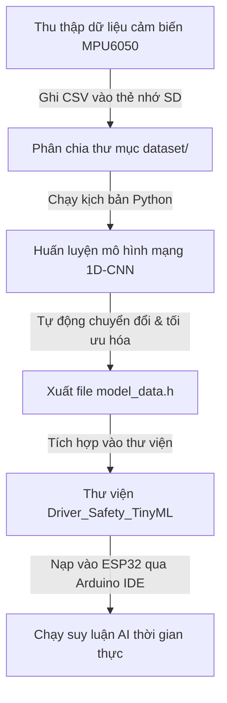

# HƯỚNG DẪN TINYML AI: NHẬN DIỆN HÀNH VI LẠNG LÁCH TRÊN ESP32
*Dành cho dự án nghiên cứu khoa học học sinh THPT*

Tài liệu này hướng dẫn từng bước từ việc thu thập dữ liệu cảm biến thực tế, huấn luyện mô hình trí tuệ nhân tạo (AI) cục bộ bằng Python, cho đến nạp mô hình vào hộp đen ESP32 dưới dạng thư viện suy luận thời gian thực.

---

## TỔNG QUAN LUỒNG HOẠT ĐỘNG


---

## BƯỚC 1: THU THẬP DỮ LIỆU CẢM BIẾN THỰC TẾ

Để mô hình AI phân biệt được hành vi lái xe thế nào là **Bình thường** và thế nào là **Lạng lách nguy hiểm**, bạn cần dạy mô hình bằng dữ liệu mẫu.

### 1. Chuẩn bị phần cứng và nạp chương trình thu thập:
1. Mở dự án `Driver_Safety_Data_Collection` trong Arduino IDE.
2. Chọn Board: **ESP32 Dev Module** (hoặc ESP32 DevKit V1) và chọn đúng cổng COM.
3. Nạp chương trình (Upload) vào ESP32.
4. Đảm bảo thẻ nhớ MicroSD đã được cắm chắc chắn và đã định dạng **FAT32**.

### 2. Tiến hành chạy xe thu thập dữ liệu:
*   **Quy trình thu thập và đóng file an toàn bằng phím bấm:**
    *   **Bắt đầu ghi**: Cấp nguồn cho hộp đen. Thiết bị sẽ kêu còi bíp dài và LED Status bắt đầu nhấp nháy nhanh. Điều này báo hiệu thẻ SD đã sẵn sàng và thiết bị đang ghi dữ liệu với tần số 50Hz.
    *   **Lái xe thử nghiệm**: Thực hiện các lượt lái xe thử nghiệm theo các trường hợp bên dưới.
    *   **Dừng ghi và Lưu file (Bắt buộc)**: Trước khi ngắt nguồn hoặc rút thẻ nhớ, bạn **phải nhấn phím BOOT** trên mạch ESP32. Khi nhấn nút:
        *   Còi bíp sẽ kêu 3 tiếng ngắn liên hồi (`bíp - bíp - bíp`).
        *   Đèn LED Status sẽ **tắt hẳn**.
        *   File CSV sẽ được đóng lại sạch sẽ và cập nhật kích thước đầy đủ trên thẻ nhớ. Lúc này bạn có thể rút nguồn hoặc lấy thẻ nhớ ra.

*   **Trường hợp 1: Lái xe bình thường (Normal)**
    *   Lắp hộp đen cố định chắc chắn lên xe máy điện/xe đạp điện.
    *   Cấp nguồn cho thiết bị, chờ đèn LED nhấp nháy nhanh thì bắt đầu lái xe đi lại một cách bình thường, thư thả, ôm cua êm ái.
    *   Làm khoảng **3-5 lượt chạy**, mỗi lượt kéo dài khoảng 2 - 3 phút. Cuối mỗi lượt, **nhấn phím BOOT** để lưu file, sau đó khởi động lại thiết bị (nhấn nút EN/RST hoặc rút nguồn cắm lại) để tạo file cho lượt tiếp theo.
    *   Rút thẻ nhớ ra, cắm vào máy tính. Bạn sẽ thấy các tệp tin dạng `data_0.csv`, `data_1.csv`...
    *   **Hành động**: Đổi tên chúng thành `normal_1.csv`, `normal_2.csv`, `normal_3.csv`...

*   **Trường hợp 2: Lái xe lạng lách, đánh võng (Swerving)**
    *   *Chú ý an toàn:* Tìm một khoảng sân rộng hoặc đường vắng không có xe qua lại.
    *   Cắm thẻ nhớ vào thiết bị, cấp nguồn và lái xe thực hiện động tác lắc xe qua trái, qua phải liên tục (mô phỏng lạng lách đánh võng).
    *   Thực hiện **3-5 lượt chạy**, mỗi lượt kéo dài khoảng 1 - 2 phút. Nhớ **nhấn phím BOOT** ở cuối mỗi lượt để lưu file an toàn.
    *   Cắm thẻ nhớ vào máy tính và đổi tên các file CSV mới sinh ra thành `swerving_1.csv`, `swerving_2.csv`, `swerving_3.csv`...

### 3. Sắp xếp thư mục dự án:
Tạo một thư mục tên là `dataset` ở ngay thư mục gốc của dự án (cùng cấp với file `train_model.py`). Sao chép toàn bộ các file CSV đã đổi tên vào đó. Cấu trúc thư mục sẽ như sau:
```text
canh bao lai xe - _sv/
├── dataset/
│   ├── normal_1.csv
│   ├── normal_2.csv
│   ├── swerving_1.csv
│   └── swerving_2.csv
├── train_model.py
└── libraries/
```

---

## BƯỚC 2: HUẤN LUYỆN MÔ HÌNH AI CỤC BỘ BẰNG PYTHON

Kịch bản `train_model.py` sử dụng thư viện TensorFlow/Keras để huấn luyện một mạng nơ-ron tích chập 1 chiều (1D-CNN) nhận đầu vào là chuỗi thời gian 2 giây dữ liệu (100 mẫu) của 6 trục cảm biến.

### 1. Cài đặt môi trường Python (chỉ chạy 1 lần duy nhất):
Mở terminal (PowerShell hoặc Command Prompt) tại thư mục dự án và chạy lệnh sau để cài đặt các thư viện học máy:
```bash
pip install tensorflow numpy pandas scikit-learn
```

### 2. Chạy kịch bản huấn luyện:
Chạy lệnh sau để bắt đầu huấn luyện:
```bash
python train_model.py
```

### 3. Kết quả đầu ra:
Sau khi quá trình huấn luyện hoàn tất (khoảng 30 giây), bạn sẽ thấy:
*   In ra màn hình độ chính xác của mô hình trên tập kiểm thử (ví dụ: `Accuracy: 95.50%`).
*   Tệp `model_data.tflite` (mô hình AI dạng nhị phân nhẹ khoảng 15-20 KB).
*   Tệp `model_data.h` (chứa mã nguồn mảng hex của mô hình AI).
*   **Điểm đặc biệt:** Kịch bản Python sẽ tự động sao chép tệp `model_data.h` này ghi đè vào thư mục thư viện `libraries/Driver_Safety_TinyML/src/model_data.h`. Bạn không cần phải copy thủ công!

---

## BƯỚC 3: CÀI ĐẶT THƯ VIỆN PHỤ TRỢ TRÊN ARDUINO IDE

Để chạy được mô hình TFLite, chúng ta sử dụng thư viện **EloquentTinyML** làm cầu nối wrapper giúp đơn giản hóa việc nhúng.

1. Mở **Arduino IDE**.
2. Chọn **Sketch** -> **Include Library** -> **Manage Libraries...** (hoặc nhấn tổ hợp phím `Ctrl + Shift + I`).
3. Nhập từ khóa tìm kiếm: **EloquentTinyML**
4. Chọn phiên bản mới nhất và nhấn **Install**.
5. *Lưu ý:* Thư viện này sẽ tự động tải các tài nguyên TensorFlow Lite Micro tương thích cho ESP32.

---

## BƯỚC 4: TÍCH HỢP VÀ CHẠY THỰC TẾ TRÊN HỘP ĐEN

Mã nguồn chính `Driver_Safety_Blackbox` đã được thiết lập sẵn 3 tùy chọn chạy phát hiện lạng lách.

### 1. Lựa chọn chế độ suy luận AI:
Mở file `Driver_Safety_Blackbox.ino`, tìm dòng cấu hình ở đầu file:
```cpp
// 0: Heuristic (Dựa trên toán học truyền thống - độ lệch chuẩn)
// 1: TinyML cục bộ (TensorFlow Lite từ file model_data.h vừa train)
// 2: Edge Impulse (Sử dụng thư viện zip từ nền tảng Edge Impulse)
#define AI_SWERVING_METHOD    1
```
Đảm bảo bạn đang đặt `AI_SWERVING_METHOD` là `1`.

### 2. Kiểm tra chế độ chạy:
Trong file `Config.h`, đảm bảo bạn đang chọn chế độ chạy thực tế:
```cpp
#define CURRENT_MODE          MODE_INFERENCE
```

### 3. Nạp code và kiểm tra:
1. Nạp code `Driver_Safety_Blackbox` vào ESP32.
2. Mở **Serial Monitor** (Tốc độ baud: **115200**).
3. Đặt thiết bị đứng yên: Màn hình sẽ hiển thị thông báo khởi tạo thành công mô hình AI.
4. Khi di chuyển thiết bị lắc qua lắc lại mô phỏng lạng lách, bạn sẽ thấy xác suất AI dự đoán in ra tăng dần:
   `AI TinyML Swerving Probability: 0.8540`
5. Nếu xác suất vượt quá `0.80`, còi chip sẽ hú tít tít dồn dập kèm đèn LED nhấp nháy báo động lái xe nguy hiểm!

---

## 💡 GỢI Ý CHO BÁO CÁO KHOA HỌC KỸ THUẬT (KHKT)
*   **So sánh hiệu quả**: Học sinh có thể làm thí nghiệm thực tế so sánh giữa phương án `Heuristic` (Phương án 0) và phương án `AI TinyML` (Phương án 1). Đo đạc số lần cảnh báo đúng (True Positive) và cảnh báo sai (False Positive) để đưa ra biểu đồ phân tích trong bài báo cáo. điều này giúp đề tài đạt điểm khoa học rất cao!
*   **Tùy biến mạng nơ-ron**: Học sinh có năng lực tốt có thể mở file `train_model.py`, chỉnh sửa cấu trúc các lớp (Dense, Conv1D) hoặc số chu kỳ huấn luyện (epochs) để tối ưu hóa thêm mô hình.
